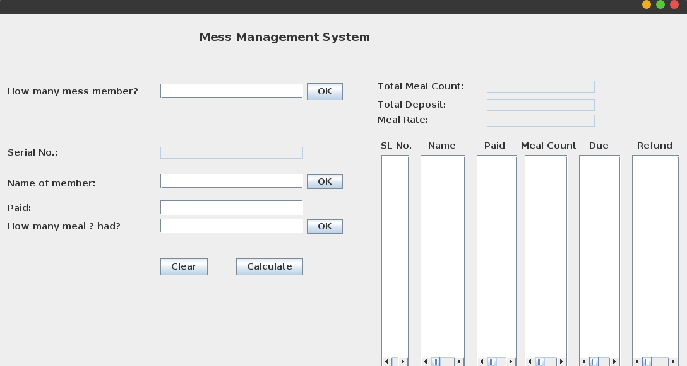
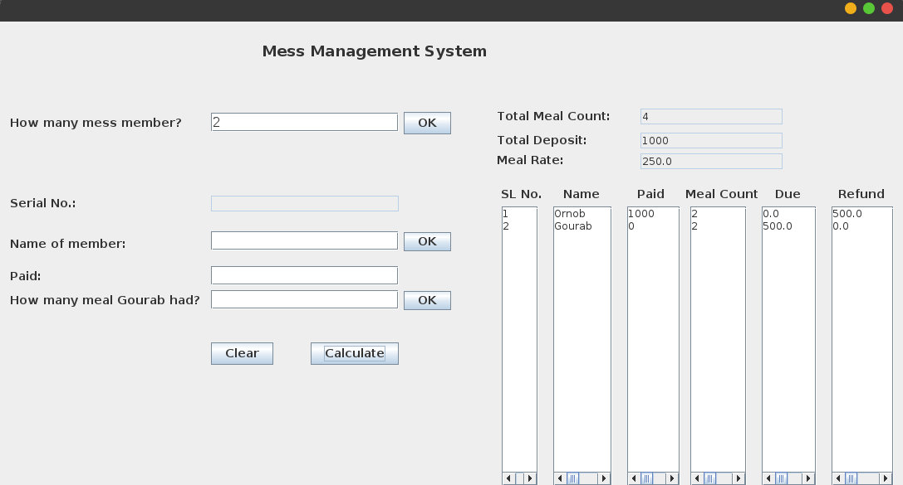

# Mess Meal Management

Its a JAVA GUI software to calculate meal rate and manage member’s payment.\
\
User needs to specify member details in addition to how much money he deposited. After that, the application calculates the meal rate and provides how much money a member needs to give or take.\
\
Java and Java Swing were used to made this.\
\
Download the [Executable File](https://github.com/ornob011/Mess_Meal_Management/blob/master/Mess/dist/Mess.jar) to run the software. Open the terminal and type: 
```
java -jar Mess.jar
```

## Interface


<p align='center'> Starting Page

<br><br>


<p align='center'> Resultant Page after submitting necessary fields